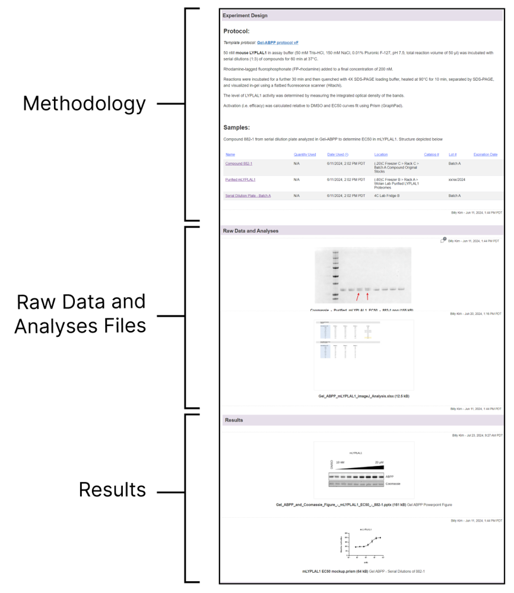
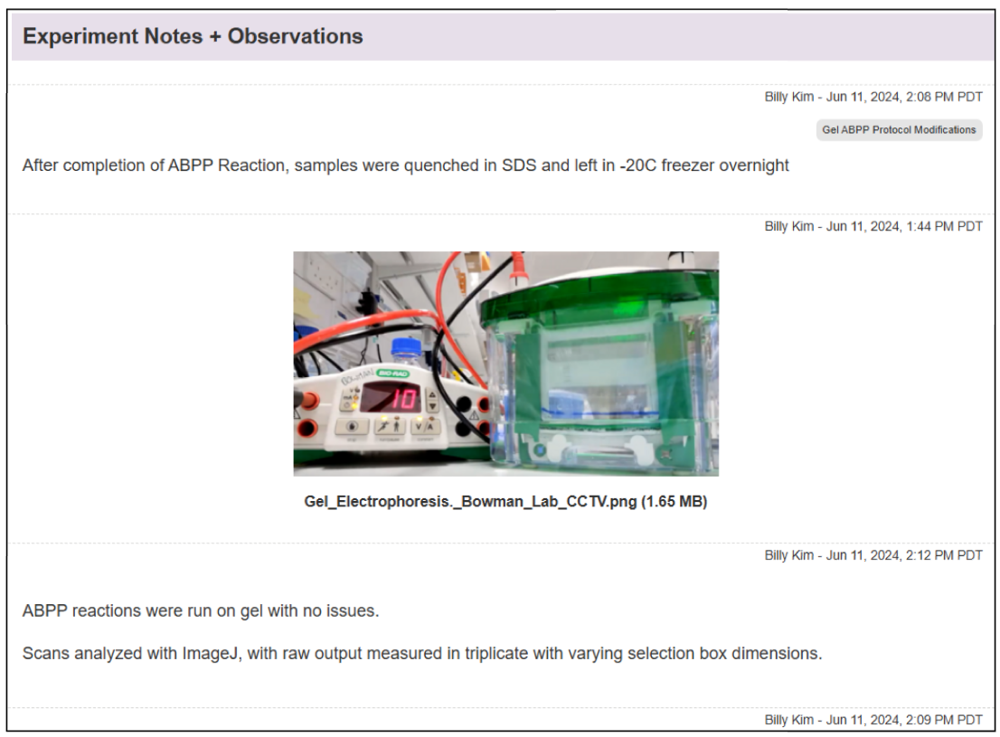

# ELNs and AI in Life Sciences

This book is the open source ecosystem contributor guide for **Pegasus**, an open standard Electronic Lab Notebook (ELN) system. This chapter sets the context for ELNs and AI in life sciences.

## What are Electronic Lab Notebooks?

An **electronic lab notebook (ELN)** is a digital software tool that replaces traditional paper notebooks for recording research. It provides a structured, secure way to document experiments, protocols, observations, and results. ELNs allow researchers to enter text and attach rich data in digital form (e.g. images, graphs, raw data files), and often include templates or forms to standardize entries. Unlike paper notebooks, ELNs make all content searchable and version-controlled. They can be synced with other lab software (like sample inventories or LIMS) and maintain tamper-proof audit trails. In short, an ELN is a modern, searchable laboratory journal that captures everything about an experiment in one place.

ELNs offer many advantages over paper. They simplify data sharing and backup, since entries are stored digitally. For example, experiments recorded in ELNs are easier to search by keyword or date. Lab notebooks can include fine-grained access controls and audit logs, so every change is tracked. Importantly, ELNs can directly import digital data from instruments (instead of printing and stapling). In practice, a scientist can upload microscope images, sensor readouts, or spreadsheet results right into the experiment record. Multiple users can collaborate on the same notebook, tagging each other's work and commenting on entries. These features make ELNs a centralized hub for research data and improve reproducibility by keeping protocols, data and analysis together.

## How ELNs are Used in Life Sciences

In biology and chemistry labs, ELNs serve as the daily research workspace. Scientists plan and record experiments by writing down protocols (materials, methods, objectives) and then logging real-time observations and data. For example, a researcher might write the background and step-by-step procedure for a gel experiment, and then enter gel image results once the run is finished. All digital outputs (images of gels or cells, instrument plots, calculations in spreadsheets) are attached to the relevant experiment page. Because the data are structured, teams can quickly compare experiments, spot trends or anomalies over time, and ensure nothing is lost. On any given day, a user might create a new notebook entry, paste in the experimental procedure, type or voice-record observations, upload photos or CSV files, and later compile results and conclusions in one section. ELNs also support cross-linking: one entry can link to previous related experiments, or to inventory entries listing specific samples and reagents used.

Undergraduates and lab technicians likewise use ELNs to follow standard templates for their experiments. Instead of writing in paper binders, a student can use an ELN "page" to fill in observed values, snap a photo of a reading, or paste in an output graph. This encourages good lab practices from the start and makes it easy to later retrieve their data. In academic research, ELNs help disparate teams share methods and results, even across institutions. For instance, one group's ELN entry on a cell culture protocol can be copied and reused by another group, with full provenance and updates tracked. By centralizing all experiment details (from methods to raw data), ELNs improve collaboration and compliance: nothing is hidden in filed notes, and supervisors can audit progress in real time.

## Different Types of Data in an ELN

ELNs can store many kinds of research data in one place. Typical content includes:

- **Textual notes and protocols:** Experiment descriptions, procedures, and conclusions are written as rich text entries. Researchers may write protocols in the notebook or attach documents, then record step-by-step methods and observations.

- **Images and media:** Photographs of experimental setups, microscope images, electrophoresis gels, or spectra are uploaded directly. Images can be annotated (e.g. marking features on a photo). ELNs even allow uploading photos taken on mobile devices during the experiment.

- **Data files and tables:** Numerical data often come as spreadsheets, CSV files, or instrument outputs. These raw data files can be attached to the entry. For example, an ELN page might include an Excel file of measurements and a MATLAB graph, stored and even viewable inside the notebook. Because ELNs are digital, they can host large raw datasets without physical limits.

- **Metadata and links:** Entries automatically include metadata like timestamps and authorship. Scientists can also tag entries or link to related pages (e.g. linking this week's experiment to a prior one). Many ELNs integrate with inventory/sample databases: entering a sample ID can record that sample in the notebook and link back to its database record.

- **Graphs and analysis results:** Final results (charts, plots, statistical analyses) are saved as figures or PDFs attached to the entry. An ELN can also embed interactive elements (e.g. live links to analysis scripts or editable spreadsheets).

An example ELN page organized into sections: Methodology (green), Raw Data/Analysis (blue), and Results (red). This illustrates how an experiment record might be structured with text and attachments. ELNs let researchers upload spreadsheets or image files to each section (for calculations or figures) and tag entries by type or project.

*Figure: An example ELN page organized into sections (Methodology, Raw Data/Analysis, Results).*

ELNs support uploading images and time-stamped notes directly from the lab. For instance, one can take a photo of a gel or experimental apparatus and insert it into the "Observations" section. ELNs allow direct incorporation of instrument data and images into entries, and users can even use mobile apps to capture handwritten notes or photos during an experiment.

Raw data (gels, spectra, spreadsheets) can be attached to ELN pages. In the example below, a gel image and an Excel calculation file are shown. ELNs make it easy to review and comment on raw data in context. Research shows that ELN entries often contain sections for uploading raw data or analysis files (images, Office files, etc.) which can then be annotated or processed within the ELN.

*Figure: Raw data (e.g. gel image, spreadsheet) attached to an ELN page.*

Protocols and experimental design details are also stored in the notebook. The figure below shows a section of an ELN entry with the experiment's Background, Objective, and Protocol steps. Protocols are typically written as rich text or document attachments in an ELN. Some systems link this protocol to inventory lists of reagents and samples, ensuring every material used is tracked.

*Figure: Protocols and experimental design in an ELN entry.*

Experimental design—hypotheses, variables, conditions, and how an experiment is structured—can also be captured in the notebook. The figure below shows how design elements are recorded alongside protocols, so that the rationale and plan for each experiment are preserved and searchable.

*Figure: Experiment design (objectives, variables, conditions) in an ELN.*

## AI & Lab Notebooks: Hackathon Ideas

The following ideas leverage the open, local architecture of the Pegasus ELN and can inspire ecosystem contributions and hackathon projects.

### Open Standards & FAIR Data

Pegasus ELN uses open data formats and APIs. Hackathon teams can leverage these by building AI "skills" or parsers that read the JSON/CSV exports of notebook entries. Ensuring data follows FAIR principles (with metadata tags and persistent IDs) makes it easier for AI tools to interpret. Because the ELN is open-source, anyone can extend it or contribute plugins. For example, one project might write a module that scans the ELN JSON to extract a timeline of reagent usage, or validates entries against a standard template.

### Local LLM Integration

Use local large language model frameworks (like Ollama or LangChain) to connect an LLM with the notebook data. For instance, teams could use OpenClaw (formerly Moltbot), an open-source AI agent, to create a lab assistant that "reads" your ELN. OpenClaw runs locally and can execute tasks on your machine. A hackathon challenge could be: "Build an OpenClaw-style agent that answers questions like 'What was the protocol for Experiment 7?' or 'Plot the time series of pH readings' by querying the ELN." Because everything is local, data never leaves the machine. This is similar to ELNs already embedding AI chat assistants for scientists.

### ML/AI for Data Analysis

Apply machine learning to common life-science datasets in the ELN. Ideas include training a CNN to classify cell images attached in notebook entries, using NLP to automatically summarize an experiment's results from the notes, or applying anomaly detection on time-course data. Since ELNs structure data across experiments, teams can aggregate past entries to train models. For example, having structured experiment data lets teams "identify trends, anomalies, and performance metrics across projects over time." A concrete project could use existing ELN data to predict the outcome of a procedure or to flag inconsistent entries.

### Interactive Knowledge Graphs

Create a knowledge graph that links items in the notebook: nodes could represent experiments, samples, genes, chemicals, etc., and edges capture relationships (e.g. "sample X was used in experiment Y"). The graph could be visualized or queried interactively. In life sciences, such graphs are powerful: they've been used to prioritize disease-related genes, suggest drug repurposing opportunities, or find new drug-target interactions. For a hackathon, a team might build a graph that automatically ingests the ELN's metadata and creates an interactive explorer, helping scientists ask questions like "Which experiments used Compound A?" or "Which samples relate to a given cell line?"

### AI Agents for Lab Workflows

Inspired by the OpenClaw example, teams can design an AI workflow manager. For example, an agent could monitor the ELN API and trigger alerts or actions: if the agent reads a note about a long incubation, it might schedule a reminder; or if it detects missing data, it could prompt the user. By integrating with messaging apps, the agent could allow voice or chat interaction ("Hey AI, summarize yesterday's chromatography run"). Essentially, this is an extension of a chatbot assistant tailored to scientific workflows.

### Open/Distributed Science

Explore connecting ELN data to open science platforms. One idea is to integrate with Bio Protocol (BIO) – a blockchain-based DeSci platform where research can be shared and tokenized. A hackathon task could be to design a way to "publish" parts of a lab notebook onto a decentralized network (e.g. save a protocol with a persistent identifier). Teams could also consider the ethos of open-notebook science, where all data (even failed experiments) are made public in real time. For example, a project could sync select ELN entries to a public repository or wiki, enabling community feedback and distributed collaboration. This connects lab work with broader citizen science and open-data movements.

Each of these ideas leverages the open, local architecture of the Pegasus ELN. Because the system's data format and API are open, contributors can freely build custom AI modules, chatbots, or graph tools that plug into the notebook. By drawing inspiration from OpenClaw/Moltbot agents, FAIR data principles, and decentralized science platforms, participants can create novel AI-powered features for life-science research. The goal is to spark creativity: for instance, one team might develop an LLM "protocol advisor," another might make an image-analysis plug-in, while another builds a knowledge-graph front-end for the lab. All of these would showcase how AI can enhance the functionality of an electronic lab notebook in a modern research setting.

## References and further reading

- [What Is an Electronic Lab Notebook? | LabKey](https://www.labkey.com/what-is-an-electronic-lab-notebook/)
- [Ten simple rules for implementing electronic lab notebooks (ELNs) - PMC](https://pmc.ncbi.nlm.nih.gov/articles/PMC11189195/)
- [Electronic lab notebook - Wikipedia](https://en.wikipedia.org/wiki/Electronic_lab_notebook)
- [Example Notebook Page - Recording an Experiment – LabArchives](https://help.labarchives.com/hc/en-us/articles/34329886396820-Example-Notebook-Page-Recording-an-Experiment)
- [The Big Picture of Data Management in an Electronic Lab Notebook (ELN) - Research Data Services](https://researchdata.wisc.edu/tools/the-big-picture-of-data-management-in-an-electronic-lab-notebook-eln/)
- [OpenClaw is an open-source AI agent that runs your computer | Scientific American](https://www.scientificamerican.com/article/moltbot-is-an-open-source-ai-agent-that-runs-your-computer/)
- [Constructing knowledge graphs and their biomedical applications - PMC](https://pmc.ncbi.nlm.nih.gov/articles/PMC7327409/)
- [Bio Protocol (BIO) – Help Centre](https://help.wealthsimple.com/hc/en-ca/articles/41701045785883-Bio-Protocol-BIO)
- [Open-notebook science - Wikipedia](https://en.wikipedia.org/wiki/Open-notebook_science)
